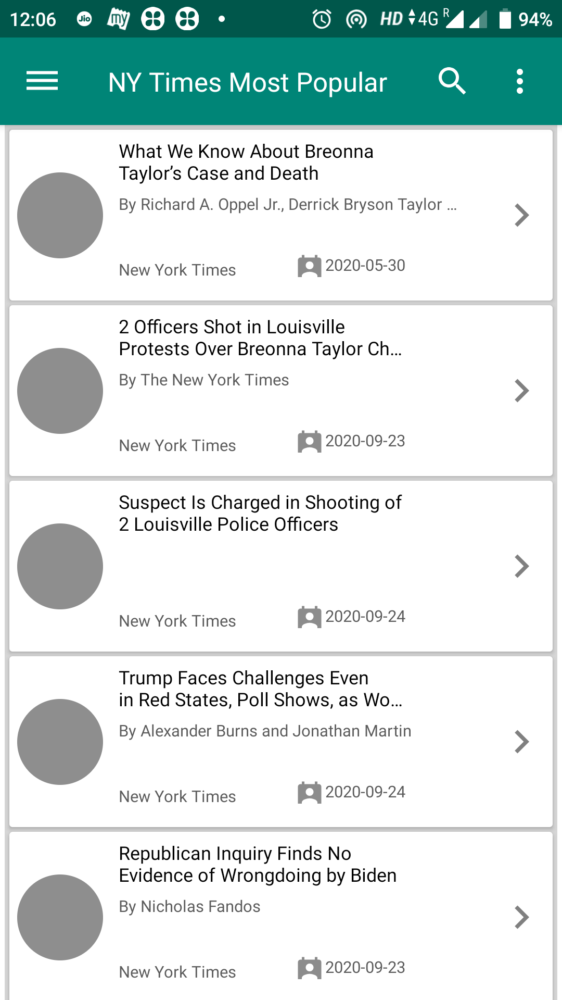
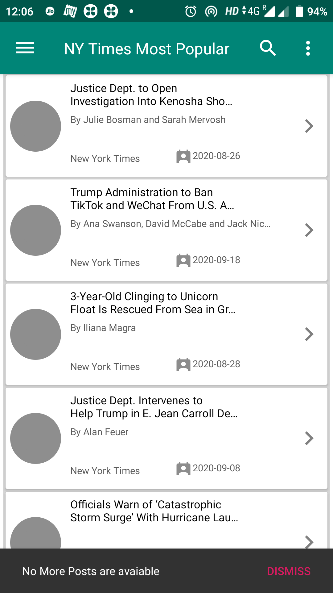

# NewYorkTimesApp
NewYork Times app illustrating Android development best practices with Android Kotlin, MVVM & DataBinding.

This app is about NY Times Most Popular Articles, In this app basically you will able to checkout 1,7 and 30 days older articles

Introduction
------------
This project uses the Gradle build system. To build this project, use the gradlew build command or use "Import Project" in Android Studio.
There are two Gradle tasks for testing the project:

There are two Gradle tasks for testing the project:
* `connectedAndroidTest` - for running Espresso on a connected device or android emulator
* `test` - for running unit tests on system

App Screenshots
-----------

Libraries Used
--------------
* [Foundation](https://developer.android.com/jetpack/components) - Components for core system capabilities, Kotlin extensions and support for
  multidex and automated testing.
  * [AppCompat](https://developer.android.com/topic/libraries/support-library/packages#v7-appcompat) - Degrade gracefully on older versions of Android.
  * [Android KTX](https://developer.android.com/kotlin/ktx) - Write more concise, idiomatic Kotlin code.
  * [Test](https://developer.android.com/training/testing/) - An Android testing framework for unit and runtime UI tests.
  
* [Architecture](https://developer.android.com/jetpack/arch/) - A collection of libraries that help you design robust, testable, and
  maintainable apps. Start with classes for managing your UI component lifecycle and handling data
  persistence.
  * [Data Binding](https://developer.android.com/topic/libraries/data-binding/) - Declaratively bind observable data to UI elements.
  * [LiveData](https://developer.android.com/topic/libraries/architecture/livedata) - Build data objects that notify views when the underlying database changes.
  * [Dagger](https://developer.android.com/training/dependency-injection/dagger-android) - Automate dependency injection in your app & you don't have to write tedious & error-prone boilerplate code.
  * [ViewModel](https://developer.android.com/topic/libraries/architecture/viewmodel) - Store UI-related data that isn't destroyed on app rotations. Easily schedule
     asynchronous tasks for optimal execution.
     
* [UI](https://developer.android.com/guide/topics/ui) - Details on why and how to use UI Components in your apps - together or separate
  * [Layout](http://reactivex.io/intro.html) - Lay out widgets using different algorithms.
* Third party
  * [Rx Java](http://reactivex.io/intro.html) for managing background threads with simplified code and reducing needs for callbacks
  * [Retrofit2](https://square.github.io/retrofit/#introduction) for client and server intreaction and callback
  
